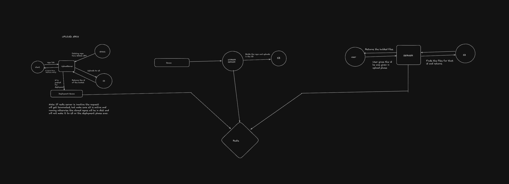

# CodeDrop - A Serverless Deployment Platform

CodeDrop is a full-stack serverless deployment platform that allows users to deploy their web applications by simply providing a Git repository URL. It handles the entire deployment lifecycle, from cloning the repository and uploading source files to AWS S3, to building the project and serving the compiled output via a custom subdomain.

## Architecture

The CodeDrop platform is composed of three main services, orchestrated using AWS S3 for storage and Redis for queuing and status management.



### 1. Upload Service (`Upload/src/index.ts`)

This service is responsible for initiating the deployment process.
-   Receives a Git repository URL via an API endpoint.
-   Generates a unique ID for the deployment.
-   Clones the provided Git repository locally.
-   Uploads all source files from the cloned repository to an AWS S3 bucket.
-   Pushes the unique deployment ID to a Redis queue (`deployQueue`) for the Deploy Service to pick up.
-   Sets the initial deployment status to "pending" in a Redis hash (`status`).
-   Provides an API endpoint to check the current status of a deployment.

**Key Endpoints:**
-   `POST /deploy`: Initiates a new deployment. Expects a JSON body with a `url` field (e.g., `{ "url": "https://github.com/user/repo" }`).
-   `GET /status/:id`: Retrieves the deployment status for a given ID.

### 2. Deploy Service (`Deploy/src/index.ts`)

This service acts as a worker that processes deployment requests from the Redis queue.
-   Continuously monitors the `deployQueue` in Redis for new deployment IDs.
-   Upon receiving an ID, it downloads the corresponding source files from AWS S3.
-   Builds the project (e.g., `npm install` and `npm run build` for Node.js projects).
-   Updates the deployment status to "completed" in the Redis `status` hash.
-   Uploads the compiled build artifacts (e.g., `dist` folder) to AWS S3, making them ready for serving.

### 3. Request Service (`Request/src/index.ts`)

This service is responsible for serving the deployed applications.
-   Acts as a reverse proxy, routing incoming requests based on the subdomain (e.g., `[deployment-id].yourdomain.com`).
-   Checks the deployment status in Redis; if "pending", it returns a pending status message.
-   If the deployment is "completed", it fetches the requested files (HTML, CSS, JS, etc.) from the AWS S3 bucket where the build artifacts were uploaded.
-   Serves the content with appropriate MIME types.

## Technologies Used

-   **Backend**: Node.js, Express.js
-   **Database/Cache**: Redis
-   **Cloud Storage**: AWS S3
-   **Version Control Integration**: `simple-git`
-   **Language**: TypeScript
-   **Build Tool**: npm/yarn (implicitly used for project builds)

## Setup and Local Development

To set up CodeDrop locally, you will need:
-   Node.js and npm/yarn
-   A running Redis instance
-   AWS credentials (Access Key ID, Secret Access Key) configured for an S3 bucket.
-   An S3 bucket named `code-drop-s3` (or configured otherwise).

### Environment Variables

Each service (Upload, Deploy, Request) will require specific environment variables. Create a `.env` file in each service directory.

**`Upload/.env`**:
```dotenv
REDIS_URL=redis://localhost:6379 # Example, if your Redis is not on default
```

**`Deploy/.env`**:
```dotenv
REDIS_URL=redis://localhost:6379 # Example, if your Redis is not on default
AWS_ACCESS_KEY_ID=YOUR_AWS_ACCESS_KEY_ID
AWS_SECRET_ACCESS_KEY=YOUR_AWS_SECRET_ACCESS_KEY
AWS_S3_ENDPOINT=YOUR_AWS_S3_ENDPOINT # Optional, for custom S3 compatible storage
AWS_S3_BUCKET_NAME=code-drop-s3 # Or your configured bucket name
```

**`Request/.env`**:
```dotenv
ACCESS_ID=YOUR_AWS_ACCESS_KEY_ID
ACCESS_KEY=YOUR_AWS_SECRET_ACCESS_KEY
EP=YOUR_AWS_S3_ENDPOINT # e.g., for localstack or custom S3 compatible storage
REDIS_URL=redis://localhost:6379 # Example, if your Redis is not on default
```

### Running the Services

1.  **Clone the repository:**
    ```bash
    git clone https://github.com/MukulPretham/CodeDrop.git
    cd CodeDrop
    ```

2.  **Install dependencies for each service:**
    ```bash
    cd Upload
    npm install
    cd ../Deploy
    npm install
    cd ../Request
    npm install
    cd ..
    ```

3.  **Start Redis:**
    Ensure your Redis server is running.

4.  **Start each service:**
    ```bash
    # In separate terminal windows
    cd Upload
    npm start # Or `npm run dev` if a dev script is available
    
    cd ../Deploy
    npm start # Or `npm run dev`
    
    cd ../Request
    npm start # Or `npm run dev`
    ```

## Usage

1.  **Deploy a project**:
    Send a POST request to the Upload service (default: `http://localhost:3000/deploy`) with your GitHub repository URL.

    ```bash
    curl -X POST -H "Content-Type: application/json" -d '{"url": "https://github.com/your-username/your-repo"}' http://localhost:3000/deploy
    ```
    You will receive a response with a unique `id` for your deployment.

2.  **Check Deployment Status**:
    ```bash
    curl http://localhost:3000/status/<your-deployment-id>
    ```

3.  **Access your deployed application**:
    Once the status changes to "completed", you can access your application via a subdomain. You'll need to configure your DNS to point `*.yourdomain.com` (or similar) to the IP address of your Request service.
    For example, if your deployment ID is `abcdef`, you would access it at `http://abcdef.yourdomain.com/`.

## Contributing

We welcome contributions! Please see our `CONTRIBUTING.md` (if available) for more details.

## License

This project is licensed under the [MIT License](LICENSE) - see the `LICENSE` file for details.